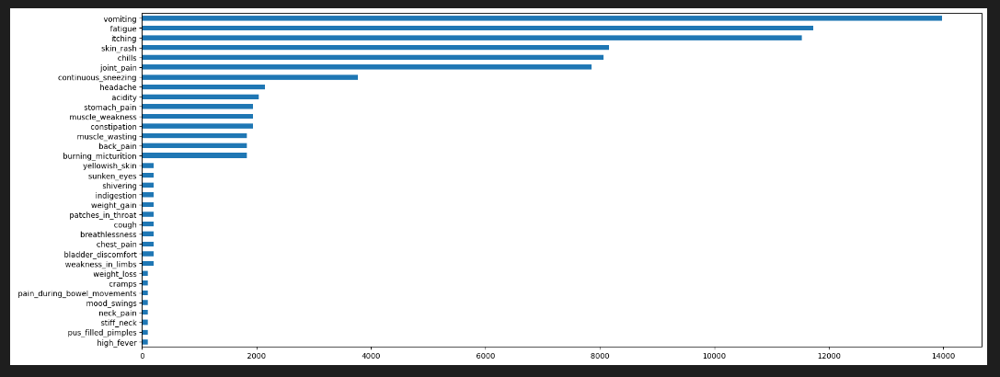
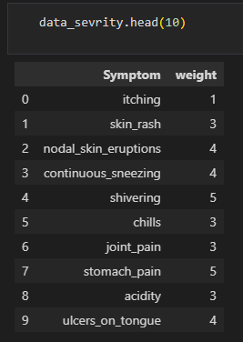
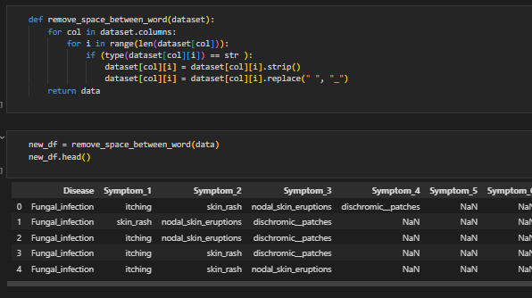
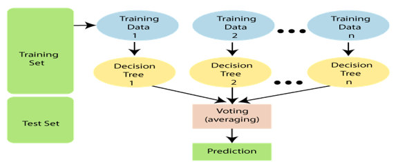
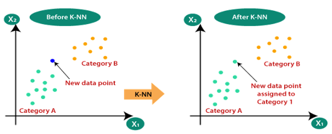
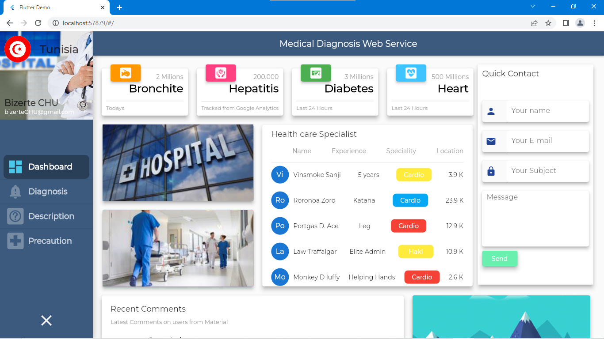
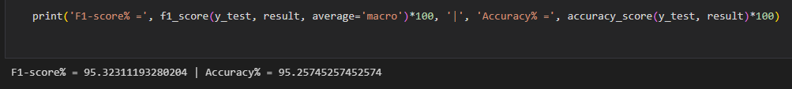
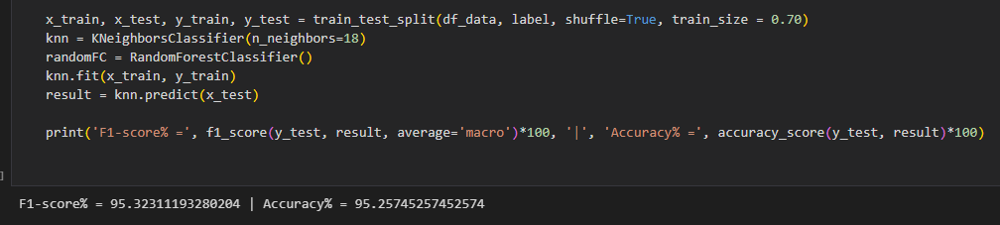
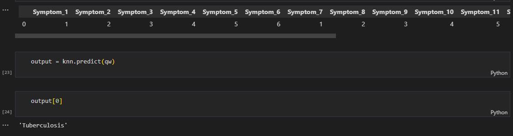
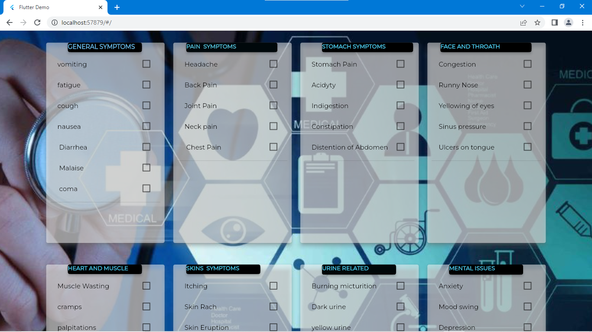

# Disease Prediction Based on Symptoms through K-NN Machine learning algorithm with UI  🩺

**Author:** Bassole Cedric-Francois   
**Course:** Machine Learning (Supervised Learning Problem)  

---

## 📖 Abstract
Any health-related issue must be accurately and promptly analyzed if it is to be prevented and treated. In the event of a critical illness, the conventional method of diagnosis might not be sufficient. A more accurate diagnosis than the traditional approach can be achieved by creating a medical diagnosis system based on machine learning algorithms for the prediction of any disease. 

With the use of ML algorithms, we have created a system for disease prediction. More than 230 diseases, their symptoms' severity, descriptions, and precautions were present in 4 processed datasets. The diagnosis system identifies the condition a person may be suffering from based on several inputted symptoms.

## 🎯 Motivation
The economy and the welfare of humanity depend on a functional healthcare system. Medical professionals often risk their own lives to save others. While virtual doctors offer remote consultations, they sometimes lack the necessary precision. 

Machines, free from human error, can process tasks rapidly while maintaining constant precision. A virtual disease predictor can correctly forecast a patient's illness without physical contact—crucial for severe cases like COVID-19 or EBOLA. This project employs a mix of machine learning methods (via Python) to forecast patient status based on hospital data, categorizing it accurately.

## 🗄️ Dataset
This project utilizes healthcare data sourced from Kaggle. The dataset contains columns for diseases, symptoms, precautions to be taken, and their weights.
A CSV data file from New York-Presbyterian Hospital (provided by the University of Columbia) was used. The Disease Symptoms data file has 4920 rows and 18 columns, while the diseases severity dataset has 133 rows and 2 columns. Common attributes include itching, skin rash, shivering, chills, and joint stiffness. 

### Data Preprocessing
The preprocessing step cleans the data by removing punctuation, deleting null values, and replacing symptoms with their specific weights.

## ⚙️ Proposed System
In this strategy, we use Machine Learning techniques and a web interface (built with Flutter) to precisely forecast a patient's ailment based on past healthcare records. 

**Advantages of the Proposed System:**
- 🏥 **Reduces Unnecessary Visits:** Seeing a doctor for minor, modest treatments becomes unnecessary.
- 🎯 **High Precision:** Delivers more precise results compared to traditional past treatments.
- 📉 **Low Risk:** Only a few risk variables are at play.

## 🧠 Models and Algorithms
To construct a disease prediction system, we applied two main supervised machine learning algorithms:

### 1. Random Forest
Used for both classification and regression issues. It is based on ensemble learning, solving complex problems by merging numerous classifiers to improve the model's performance.

### 2. K-Nearest Neighbors (K-NN)
One of the most fundamental algorithms. It assumes that new data and previous cases are comparable, assigning the new case to the most similar category. It quickly filters fresh data into the appropriate category based on similarity.

## 🔬 Experimentation and Tech Stack
To conduct the experiments, we used:
- **Python 3 / Jupyter Notebook:** For data processing and model training.
- **Azure Machine Learning:** Used with an embedded Python script to deploy a web service for testing purposes.
- **Flutter:** Used to build the cross-platform web interface.

## 📊 Metrics and Results

### Assessment Metrics
We achieve accurate disease prediction by supplying exact symptoms as input to the system. The model's accuracy is evaluated using a Confusion Matrix.

### Training Results
The system evaluates binary datasets (0s and 1s representing the absence/presence of symptoms) to train the model effectively.

### Predictions and Outputs
Once the model assesses the user's symptoms, it successfully forecasts the associated disease. 

Below is the diagnosis page from the web interface where a user can enter their name, select their symptoms, and get a predicted diagnosis:

## 💡 Conclusion
Disease prediction using machine learning is highly crucial to our daily lives and the healthcare sector. It allows doctors to anticipate the development of common diseases that, if untreated, can cause severe issues. 

By allowing users to simply input their symptoms online, it prevents unnecessary hospital visits for minor ailments while significantly reducing the workload on doctors, enabling the healthcare system to function more efficiently.
